# Results

## 1. Generated Samples

### Flow Matching
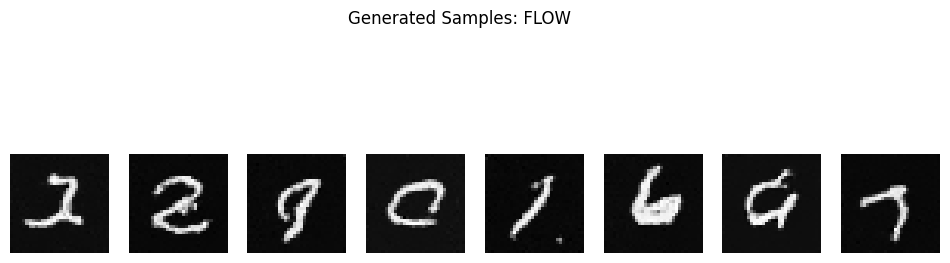

### Diffusion (DDPM)
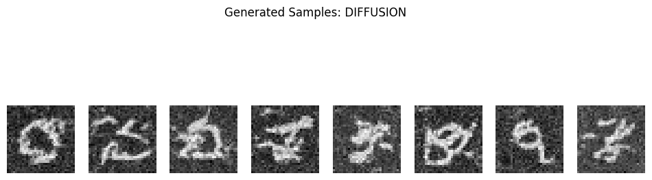

## 2. Generation Dynamics

### Flow
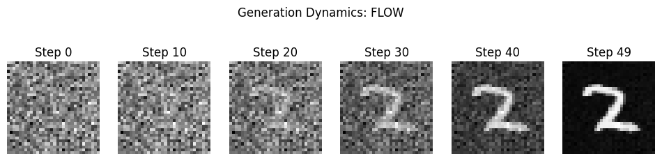

### Diffusion
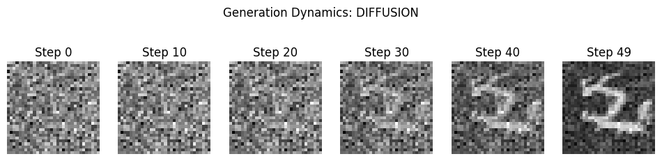

## 3. Latent Space Interpolation

### Flow
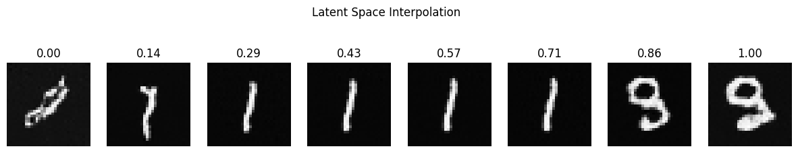

### Diffusion
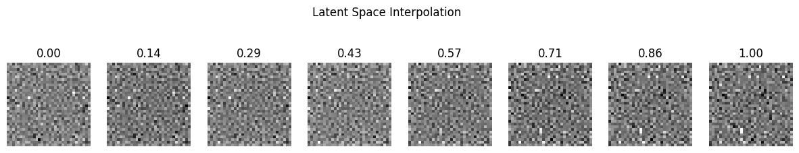

## 4. Transport Efficiency

### Flow
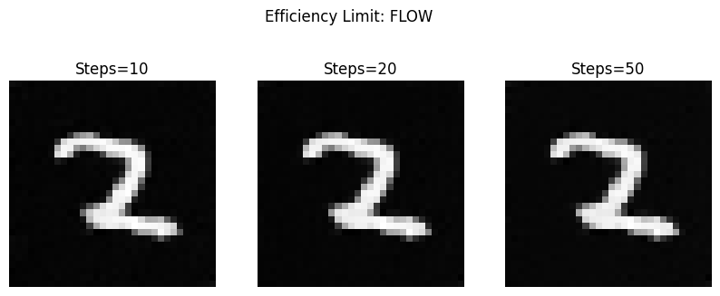

### Diffusion
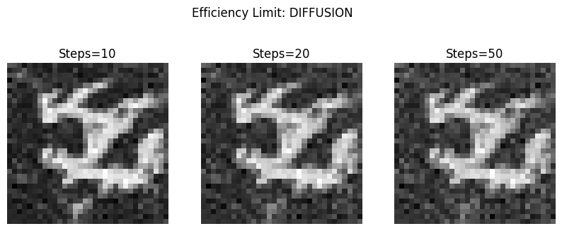

## 5. Curvature Analysis

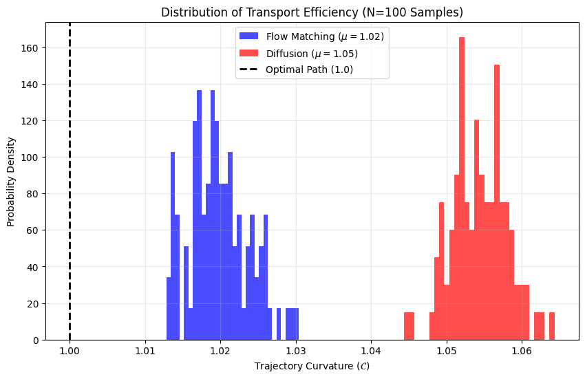

## 6. Vector Field Visualization

### Flow
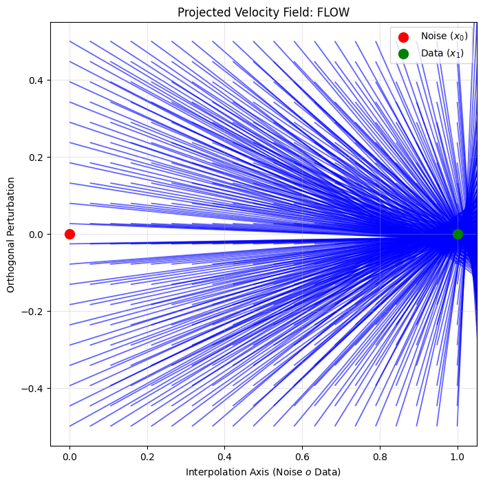

### Diffusion
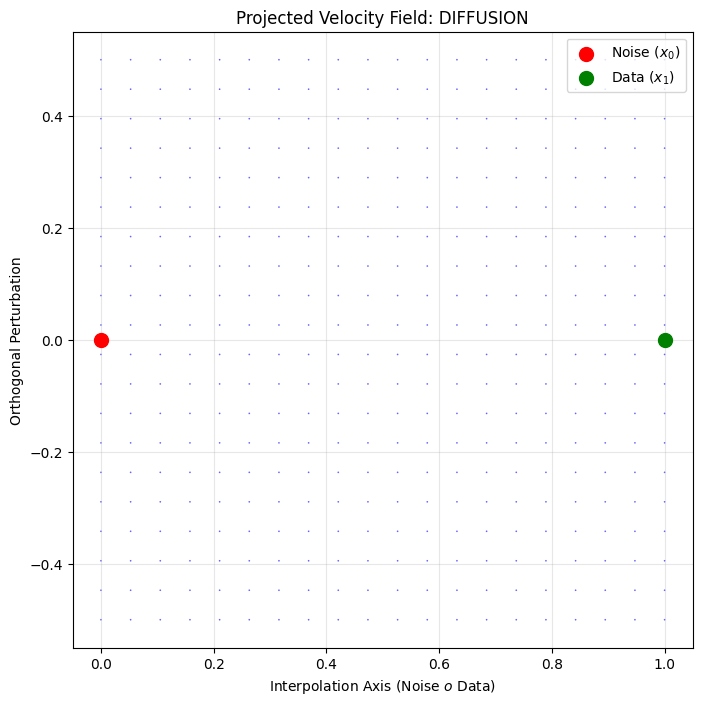

## 7. Solver Comparison (Flow)

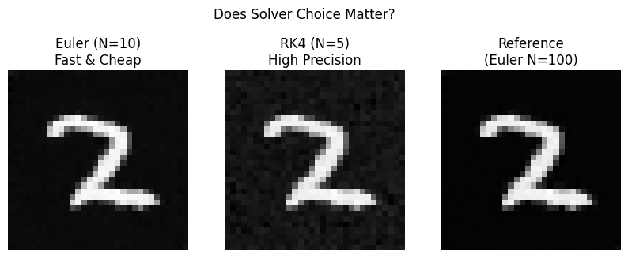

## Key Observations

- Flow Matching produces smoother and more structured samples
- Diffusion introduces higher stochasticity
- Flow trajectories are closer to optimal transport (lower curvature)
- Solver choice significantly impacts Flow-based generation

## Stats

Flow Mean Curvature: ~1.02
Diffusion Mean Curvature: ~1.05
**Observation:** Flow is closer to optimal transport (1.0)
